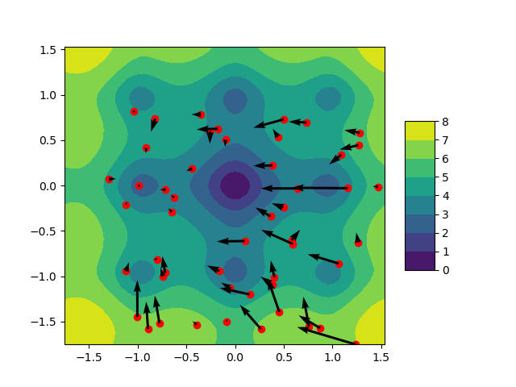

# Swarm-Algorithms
Python implemntation of swarm algorithms used for solveing non-convex optimization problems. 



## Getting Started

In order to check how the implemented algorithms work just run [main.py](main.py). Originally it will use PSO for optimization of the Auckley function. 
If you want to check either different function or different optimization method just uncomment the codeline. 
The default training loop for every i=30 steps show the positions of agents on a 2d visualisation. Furthermore it show a 3d visualisation after the end of optimization process. 

```python
NUMBER_OF_STEPS = 30
NUMBER_OF_AGENTS = 50

optimised_function = Auckley()
#optimised_function = Michalkiewicz()

if __name__ == '__main__':
    swarm = PSO(optimised_function=optimised_function, number_of_agents=NUMBER_OF_AGENTS)
    # swarm = SPP(optimised_function=optimised_function, number_of_agents=NUMBER_OF_AGENTS)
    # swarm = AAA(optimised_function=optimised_function, number_of_agents=NUMBER_OF_AGENTS)

    particles_in_step = []

    for i in trange(NUMBER_OF_STEPS):
        swarm.step()
        if i % 30 == 0:
            print(swarm.optimized_function(swarm.best_solution), swarm.best_solution)
            optimised_function.plot_2d(points=np.array([particle.position for particle in swarm.particles]), dirs=np.array([particle.velocity for particle in swarm.particles]))

    optimised_function.plot_3d(points=np.array([particle.position for particle in swarm.particles]))

```

## Implemented Swarm Algorithms
Three different optimisation algorithms have been implemented. Each algorithm for both functions is capable of finding the global solution in a finite number of steps.

### Paricle Swarm Optimization (PSO)

PSO is a basic algorithm that uses so-called "collective intelligence" to solve optimization problems. The general idea is to locate the number of particles (agents) in a different part of an input space and in each step change their velocity vector according to three factors: particle's velocity from the previous step (V_{t-1}), the best position the particle ever reach (P_best) and the best position any particle from a swarm ever reached (P_best).

<a href="https://www.codecogs.com/eqnedit.php?latex=V_{t}&space;=&space;V_{t-1}&space;&plus;&space;(\gamma)&space;*&space;c_1&space;*&space;r_1&space;*&space;(P_{best}&space;-&space;X_{t-1})&space;&plus;&space;c_2&space;*&space;r_2&space;*&space;(G_{best}&space;-&space;X_{t-1})" target="_blank"></a>

For more details check out the article about PSO on [wikipedia](https://en.wikipedia.org/wiki/Particle_swarm_optimization)

### Self Propelled Particles (SPP)

SPP, similarly to PSO, assumes a colony of particles moving in a certain direction through the space of solutions, however, it differs in assumptions regarding the update of their motion parameters. The basic assumption is that the speed of each particle remains constant, and only its direction of movement changes. The algorithm itself in the basic form is very general and does not define the exact way in which the directions are updated

In our implementation, we propose a solution where a velocity vector is changed in the two "substeps"

1) In the first substep, all the particles set their velocity towards exactly the best global solution found in the previous step

2) In the second substep, the velocity vector of each particle is mixed with the average velocities of k its neighbors

Therefore contrary to the PSO in SPP the velocity vector changes only its direction but doesn't change its length. 

### Artificial Algae Algorithm (AAA)

Method inspired by [Artificial algae algorithm (AAA) for nonlinear global optimization, Uymaz et al.](https://www.sciencedirect.com/science/article/abs/pii/S1568494615001465?via%3Dihub), which is a combination of a swarm and genetic optimization methods. Algae move in circles, and each move loses some of their energy. When the alga improves its position then it is fed, if it worsens it is not. In each step, the "e" weakest (with the lowest energy level) algae are eliminated. In the proposed implementation, the amount of food delivered to the alga is proportional to its level of improvement.

## Testing functions

Two non-convex function functions - [Auckley](https://www.sfu.ca/~ssurjano/ackley.html) and [Gierwank](https://www.sfu.ca/~ssurjano/griewank.html) has been implemented. Both functions work for any number of dimensions (n).

### Auckley function

Auckley is as a classic non-convex function that is used for evaluation of swarm optimization algorithms. It is given by the following equation

<a href="https://www.codecogs.com/eqnedit.php?latex=f(\mathbf{x})&space;=&space;-20&space;exp(-0.2&space;\sqrt{\frac{1}{n}&space;\sum_{i=1}^n&space;x_i^2})&space;-&space;exp(\frac{1}{n}&space;\sum_{i=1}^n&space;cos(2\pi&space;x_i))&space;&plus;&space;20&space;&plus;&space;e" target="_blank"></a>

And has global minimim at:

<a href="https://www.codecogs.com/eqnedit.php?latex=f(0,&space;\cdots,&space;0)&space;=&space;0" target="_blank"></a>


### Gierwank function
Gierwank is another non-convex functon that can be used for evaluation of swarm optimization algorithms. It is given by the following equation

<a href="https://www.codecogs.com/eqnedit.php?latex=f(\mathbf{x})&space;=&space;1&space;&plus;&space;\frac{1}{4000}&space;\sum_{i=1}^n&space;x^2_i&space;-&space;\prod_{i=1}^n&space;cos(\frac{x_i}{\sqrt{i}})" target="_blank"></a>

And has global minimim at:

<a href="https://www.codecogs.com/eqnedit.php?latex=f(0,&space;\cdots,&space;0)&space;=&space;0" target="_blank"></a>


## Visualisations
To better understand how the algorithms work we propose two methods of visualization. Both methods work with 2D realizations of optimized functions. 
The first method scatter the function on a 2D plane and uses color as a function value at a point. Moreover for PSO and SPP, we show velocity vectors (AAA has no such thing). The second method is using the 3rd dimension to show the actual function value.
For both methods, we show function values for every point from the domain as well as the positions of every agent. 

Both visualisation methods can be found in [abstract_testing_function.py](abstract_testing_function.py)
## Authors

* [tugot17](https://github.com/tugot17)
* [snufkin12](https://github.com/snufkin12)


## License

This project is licensed under the MIT License - see the [LICENSE](LICENSE) file for details
